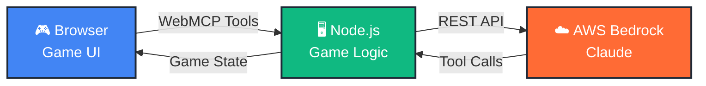
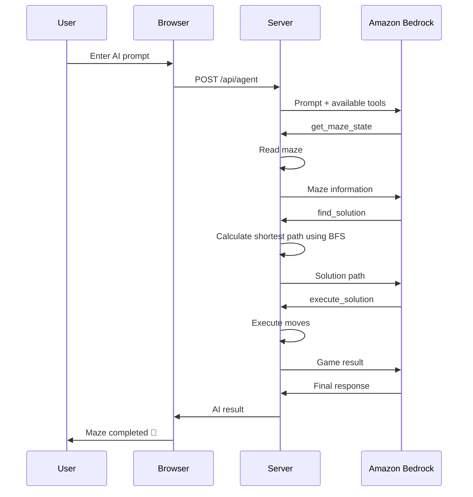

# 🧩 Maze Escape — AI-Powered WebMCP Challenge

> **An interactive maze game where an AI agent can observe, plan, and solve the maze using WebMCP tools and Amazon Bedrock Claude.**

🎮 **Play the Game:** https://maze-gameai.netlify.app/

---

## 🚀 Overview

**Maze Escape** is a browser-based maze game that combines traditional gameplay with **AI agent interaction**.

You can either:

* 🎮 Solve the maze manually using keyboard controls
* 🤖 Give instructions to an AI agent and watch it solve the maze
* 🧭 Let the AI find the shortest path using BFS
* ⚡ Let the AI execute the complete solution automatically
* 📊 Track moves, time, progress, and game status in real time

The project demonstrates how an AI model can interact with a real application through **tools**, rather than simply generating text.

---

# ✨ Key Features

### 🎮 Manual Gameplay

Control the player using:

* Arrow keys
* WASD
* Gamepad support

Navigate through the maze and reach the exit before time runs out.

### 🤖 AI Agent Mode

Give the AI a natural-language instruction such as:

```text
Solve the maze as fast as possible.
```

The AI can then interact with the game using the available tools.

### 🧠 Shortest-Path Solving

The `find_solution` tool uses **Breadth-First Search (BFS)** to calculate the shortest route from the player's current position to the exit.

### ⚡ One-Click AI Execution

The `execute_solution` tool allows the AI to execute the complete calculated path instead of making every movement individually.

### 🎯 Multiple Difficulties

| Difficulty | Maze Size |
| ---------- | --------: |
| 🟢 Easy    |   10 × 10 |
| 🟡 Medium  |   20 × 20 |
| 🔴 Hard    |   30 × 30 |

### 💬 Custom AI Prompts

Users can control how the AI approaches the challenge.

Example prompts:

```text
Solve the maze as fast as possible.

Find the shortest path and navigate through it.

Get the maze state and complete it step by step.

Use the available tools to solve the maze.

Find the solution and execute it.
```

### 📊 Live Game Statistics

Track:

* Current moves
* Elapsed time
* Player position
* Game status
* AI activity
* Completion status

---

# 🏗️ Architecture



### How the system works

```text
User
  │
  ▼
Browser Game
  │
  │ WebMCP Tool Interaction
  ▼
Node.js / Express
  │
  │ API Request
  ▼
Amazon Bedrock
  │
  │ Claude Tool Calls
  ▼
Game Tools
  │
  ├── Read maze
  ├── Check player
  ├── Find moves
  ├── Calculate solution
  ├── Execute moves
  └── Check result
  │
  ▼
Game Updated
```

---

# 🤖 AI Agent Workflow

The AI agent follows a simple tool-based workflow:



---

# 🛠️ AI Tools

The AI agent has access to **8 tools** for interacting with the maze.

| Tool                  | Purpose                                           |
| --------------------- | ------------------------------------------------- |
| `get_maze_state`      | Retrieves the maze layout, walls, start, and exit |
| `get_player_state`    | Returns the player's current position and state   |
| `get_available_moves` | Determines which directions are currently valid   |
| `move_player`         | Moves the player one step                         |
| `restart_game`        | Resets the current game                           |
| `get_game_status`     | Checks whether the game has been completed        |
| `find_solution`       | Calculates the shortest path using BFS            |
| `execute_solution`    | Executes the complete solution path               |

### Tool Categories

```text
OBSERVATION
├── get_maze_state
├── get_player_state
├── get_available_moves
└── get_game_status

ACTION
├── move_player
├── execute_solution
└── restart_game

PLANNING
└── find_solution
```

This separation allows the AI to **observe the environment, make decisions, and interact with the game through tools**.

---

# 🧠 Why WebMCP?

The key idea behind this project is **tool-based AI interaction**.

Instead of giving Claude only a text description of the maze, the application exposes game capabilities as tools.

For example:

```text
AI
 │
 ├── "I need to understand the maze."
 │
 ├── get_maze_state()
 │
 ├── "I need the shortest route."
 │
 ├── find_solution()
 │
 ├── "I should execute the route."
 │
 ├── execute_solution()
 │
 └── "The game is complete."
```

This allows the AI to interact with the application programmatically.

---

# 🧭 Pathfinding

The maze solver uses **Breadth-First Search (BFS)**.

BFS is suitable because every movement has the same cost.

Conceptually:

```text
Start
  ↓
Explore neighboring cells
  ↓
Explore next level
  ↓
Continue until Exit
  ↓
Reconstruct shortest path
```

Example:

```text
Start → → ↓ ↓ → → ↓ → Exit
```

The resulting path can then be passed to:

```text
execute_solution()
```

for automatic execution.

---

# 🎮 How to Play

## Manual Mode

1. Open the game.
2. Select a difficulty.
3. Click **Start Game**.
4. Use **Arrow Keys** or **WASD**.
5. Navigate to the exit.
6. Complete the maze before the timer expires.

---

## 🤖 AI Mode

1. Start a new game.
2. Open the **AI Agent** panel.
3. Enter a custom prompt.
4. Start the AI agent.
5. Watch the tool calls and progress.
6. The AI retrieves the maze.
7. The AI calculates a solution.
8. The AI executes the solution.
9. The game reports the result.

---

# 🧪 Example AI Prompts

### Basic

```text
Solve the maze.
```

### Fast

```text
Solve the maze as fast as possible.
```

### Shortest Path

```text
Find the shortest path and navigate through it.
```

### Tool-Based

```text
Use the available tools to inspect and solve the maze.
```

### Step-by-Step

```text
Get the maze state and complete the maze step by step.
```

---

# 🏆 What Makes This Project Different?

Traditional maze games usually provide:

```text
Human → Controls → Maze
```

Maze Escape adds:

```text
Human
  ↓
Natural Language
  ↓
AI Agent
  ↓
Tools
  ↓
Game Environment
```

The AI is therefore able to **interact with an actual game environment instead of simply describing what the user should do**.

---

# 🛠️ Tech Stack

| Layer             | Technology              |
| ----------------- | ----------------------- |
| Frontend          | HTML5, CSS3, JavaScript |
| Game Engine       | JavaScript              |
| Backend           | Node.js, Express        |
| AI                | Amazon Bedrock          |
| Model             | Claude                  |
| Agent Interaction | WebMCP / Tool Calling   |
| Pathfinding       | BFS                     |
| Deployment        | Netlify                 |
| Serverless        | Netlify Functions       |

---

# 📁 Project Structure

```text
maze_bedrock_webmcp/
│
├── app.js
│   └── Browser-side game logic
│
├── server.js
│   └── Local Node.js / Express server
│
├── index.html
│   └── Game interface
│
├── styles.css
│   └── UI styling
│
├── package.json
│   └── Dependencies and scripts
│
├── netlify.toml
│   └── Netlify configuration
│
└── netlify/
    └── functions/
        └── agent.js
            └── AWS Bedrock integration
```

---

# 🚀 Run Locally

## Prerequisites

Make sure you have:

* Node.js 20+
* AWS account
* Amazon Bedrock access
* AWS credentials

---

## 1. Clone the Repository

```bash
git clone <repository-url>
cd maze_bedrock_webmcp
```

---

## 2. Install Dependencies

```bash
npm install
```

---

## 3. Configure AWS

You can configure AWS using the CLI:

```bash
aws configure
```

Or create a `.env` file:

```env
MY_AWS_ACCESS_KEY_ID=your_key
MY_AWS_SECRET_ACCESS_KEY=your_secret
MY_AWS_REGION=us-east-1
BEDROCK_MODEL_ID=your_model_id
```

---

## 4. Start the Application

```bash
npm start
```

Then open:

```text
http://localhost:8000
```

---

# 🌐 Deploy to Netlify

## 1. Push to GitHub

```bash
git add .
git commit -m "Deploy Maze Escape"
git push origin main
```

## 2. Connect Repository to Netlify

1. Open Netlify.
2. Select **Add new site**.
3. Connect your GitHub repository.
4. Select the Maze Escape repository.
5. Deploy the site.

## 3. Configure Environment Variables

Add the required AWS variables in your Netlify site settings:

```text
MY_AWS_ACCESS_KEY_ID
MY_AWS_SECRET_ACCESS_KEY
MY_AWS_REGION
BEDROCK_MODEL_ID
```

Your deployed application can then communicate with Amazon Bedrock through the serverless function.

---

# 🔒 Security

AWS credentials should **never be exposed to the browser**.

The intended architecture is:

```text
Browser
   │
   │ Safe API request
   ▼
Server / Netlify Function
   │
   │ AWS credentials
   ▼
Amazon Bedrock
```

### Security practices

✅ Keep AWS credentials server-side
✅ Store secrets in environment variables
✅ Never commit `.env` to Git
✅ Use IAM permissions with least privilege
✅ Do not expose AWS keys in frontend JavaScript

Add this to `.gitignore`:

```text
.env
node_modules/
```

---

# 🐛 Troubleshooting

| Problem                    | Possible Solution                               |
| -------------------------- | ----------------------------------------------- |
| AWS credentials error      | Check AWS credentials and environment variables |
| AI doesn't respond         | Verify Bedrock access and model configuration   |
| Maze doesn't load          | Check browser console                           |
| AI agent times out         | Check server/Netlify function logs              |
| Bedrock request fails      | Verify region, model ID, and IAM permissions    |
| Local server doesn't start | Run `npm install` and check Node.js version     |

---

# 📊 Demo Flow

A simple demonstration can be:

```text
1. Open Maze Escape
        ↓
2. Select 20×20 maze
        ↓
3. Start the game
        ↓
4. Enter:
   "Solve the maze using the available tools."
        ↓
5. AI retrieves maze state
        ↓
6. AI finds shortest path
        ↓
7. AI executes solution
        ↓
8. Maze completed 🎉
```

---

# 🔮 Future Improvements

Potential extensions include:

* 🔄 Dynamic maze generation
* 🧠 AI-based maze strategy selection
* 👤 Human vs AI competitions
* 🏆 Global leaderboard
* 📊 Detailed AI performance analytics
* ⏱️ Time and move-based challenges
* 🧩 More complex maze environments
* 🔁 Dynamic replanning
* 🤖 Multiple AI agents competing
* 🎯 Constraint-based AI challenges

---

# 🎯 Project Goal

Maze Escape demonstrates a practical concept:

> **AI becomes more useful when it can interact with applications through tools instead of only generating text.**

By combining **WebMCP, Amazon Bedrock, Claude, tool calling, Node.js, and BFS pathfinding**, the project creates an interactive environment where an AI agent can perceive the game state, select tools, solve the problem, and interact with the application.

---

# 👨‍💻 Project

**Maze Escape — AI Challenge**

🎮 Live Demo: https://maze-gameai.netlify.app/

Built with:

**HTML • CSS • JavaScript • Node.js • Express • WebMCP • Amazon Bedrock • Claude • BFS • Netlify**

---

## 📚 Resources

* AWS Bedrock Documentation
* Anthropic Claude Documentation
* Model Context Protocol Documentation
* Netlify Functions Documentation
