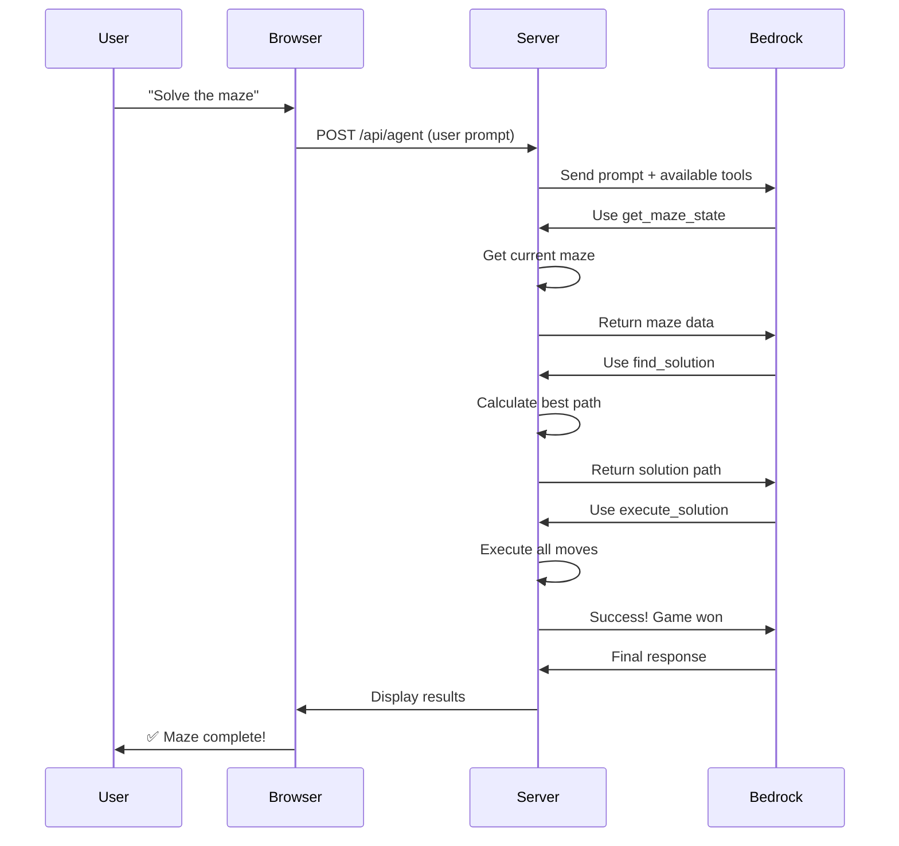
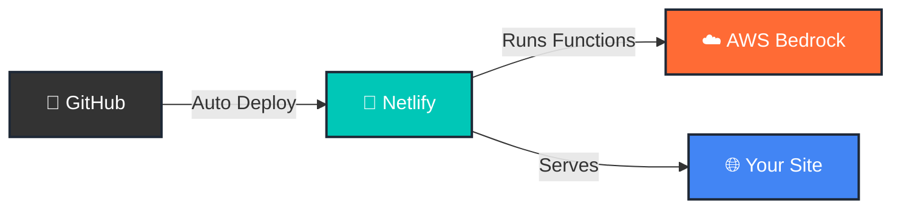
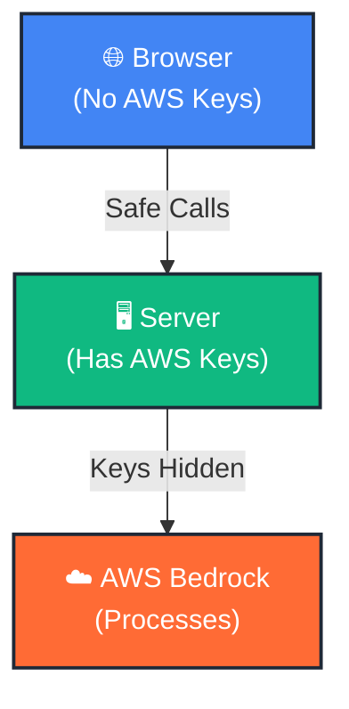

# Maze Escape — AI Challenge

> **🎮 Play Now:** [https://maze-gameai.netlify.app/](https://maze-gameai.netlify.app/)

A browser-based maze game where you can **navigate manually** or let an **AI agent solve it** for you in real-time.

## 🎯 What You Can Do

- 🎮 **Play the maze yourself** - Use arrow keys or gamepad to navigate
- 🤖 **Let AI solve it** - Watch the agent find the shortest path
- 🎯 **3 difficulty levels** - 10×10, 20×20, and 30×30 mazes
- 💬 **Custom prompts** - Give the AI specific instructions
- 📊 **Live stats** - Track moves, time, and game progress

## 🏗️ How It Works


## 🛠️ Tech Stack

| Layer | Tech |
|-------|------|
| **Frontend** | HTML5, CSS, JavaScript |
| **Backend** | Node.js, Express |
| **AI** | Amazon Bedrock (Claude) |
| **Deploy** | Netlify |

## 🚀 Quick Start (2 Minutes)

### 1. Prerequisites
- Node.js 20+ ([Download](https://nodejs.org/))
- AWS Account with Bedrock access
- AWS credentials configured

### 2. Setup
```bash
# Clone repo
git clone <repository-url>
cd maze_bedrock_webmcp

# Install dependencies
npm install

# Configure AWS (choose one)
aws configure  # Option A: AWS CLI
# OR
# Edit .env with your credentials  # Option B: Environment file
```

### 3. Run
```bash
npm start
# Open http://localhost:8000
```

## � How to Play

### Manual Mode
1. Click **"Start Game"**
2. Use **Arrow Keys** or **WASD** to navigate
3. Reach the **exit** before time runs out
4. Win! 🎉

### AI Mode (Watch the AI Solve It)
1. Start a new game
2. Enter a prompt in the **"AI AGENT"** panel
3. Click **"Start Game"**
4. Watch the agent solve it in the log

**Example AI Prompts:**
```
Solve the maze as fast as possible.
Find the shortest path and navigate through it.
Get the maze state and complete it step by step.
```

## 🔧 AI Agent Workflow



## 🛠️ Available AI Tools

The AI agent can use these 8 tools to interact with the maze:

```mermaid
graph TB
    Agent["🤖 AI Agent"]
    
    Agent -->|1| GetMaze["📋 get_maze_state"]
    Agent -->|2| GetPlayer["👤 get_player_state"]
    Agent -->|3| GetMoves["🔀 get_available_moves"]
    Agent -->|4| Move["➡️ move_player"]
    Agent -->|5| Restart["🔄 restart_game"]
    Agent -->|6| Status["📊 get_game_status"]
    Agent -->|7| FindSol["🧭 find_solution"]
    Agent -->|8| Execute["⚡ execute_solution"]
    
    style Agent fill:#FF6B35,stroke:#1F2937,stroke-width:2px,color:#fff
    style GetMaze fill:#4285F4,stroke:#1F2937,stroke-width:2px,color:#fff
    style GetPlayer fill:#4285F4,stroke:#1F2937,stroke-width:2px,color:#fff
    style GetMoves fill:#4285F4,stroke:#1F2937,stroke-width:2px,color:#fff
    style Move fill:#10B981,stroke:#1F2937,stroke-width:2px,color:#fff
    style Restart fill:#10B981,stroke:#1F2937,stroke-width:2px,color:#fff
    style Status fill:#4285F4,stroke:#1F2937,stroke-width:2px,color:#fff
    style FindSol fill:#F59E0B,stroke:#1F2937,stroke-width:2px,color:#fff
    style Execute fill:#F59E0B,stroke:#1F2937,stroke-width:2px,color:#fff
```



| Tool | What It Does |
|------|-------------|
| `get_maze_state` | See the maze layout and walls |
| `get_player_state` | Check position and game status |
| `get_available_moves` | Find valid directions to move |
| `move_player` | Move one step in a direction |
| `restart_game` | Reset the maze to start |
| `get_game_status` | Check if you won |
| `find_solution` | Calculate shortest path (BFS) |
| `execute_solution` | Play the entire solution in one call ⚡ |

## � Project Structure

```
maze_bedrock_webmcp/
├── app.js                    # Game logic (runs in browser)
├── server.js                 # Backend server
├── index.html                # Game UI
├── styles.css                # Styling
├── package.json              # Dependencies
├── netlify.toml              # Deployment config
└── netlify/
    └── functions/
        └── agent.js          # AWS Bedrock integration
```

## 🌐 Deploy to Netlify (5 Minutes)



### Steps

1. **Push to GitHub**
```bash
git add .
git commit -m "Deploy Maze Escape"
git push origin main
```

2. **Connect to Netlify**
   - Go to [netlify.com](https://netlify.com)
   - Click "New site from Git"
   - Select your repository
   - Click Deploy

3. **Add AWS Credentials** (Netlify Site Settings → Environment)
```
MY_AWS_ACCESS_KEY_ID=your_key
MY_AWS_SECRET_ACCESS_KEY=your_secret
MY_AWS_REGION=us-east-1
BEDROCK_MODEL_ID=global.anthropic.claude-haiku-4-5-20251001-v1:0
```

✅ Your site is live at `https://your-site.netlify.app/`

## 🔒 Security



✅ **AWS credentials are kept on the server only**  
✅ **Browser never has direct AWS access**  
✅ **Use .env for local development (not in Git)**  
✅ **Use IAM roles with minimal permissions**

### Environment File (.env)
```env
MY_AWS_ACCESS_KEY_ID=your_key
MY_AWS_SECRET_ACCESS_KEY=your_secret
MY_AWS_REGION=us-east-1
BEDROCK_MODEL_ID=...
```
**Never commit this file!**

## �️ Development

### Run Locally
```bash
npm start
# Open http://localhost:8000
```

### Test the AI Agent
Use the **Custom Prompt** box to test:

```
Solve the maze using the tools available to you.
```

### Troubleshooting

| Problem | Solution |
|---------|----------|
| AWS credentials error | Run `aws configure` or set .env variables |
| AI not responding | Check AWS region is `us-east-1` and credentials are valid |
| Maze won't load | Open browser console and check for errors |
| Agent timeout | Check Netlify/server logs |

## 📚 Learn More

- [AWS Bedrock Docs](https://docs.aws.amazon.com/bedrock/)
- [Claude API](https://docs.anthropic.com/)
- [Model Context Protocol](https://modelcontextprotocol.io/)
- [Netlify Functions](https://docs.netlify.com/functions/overview/)
